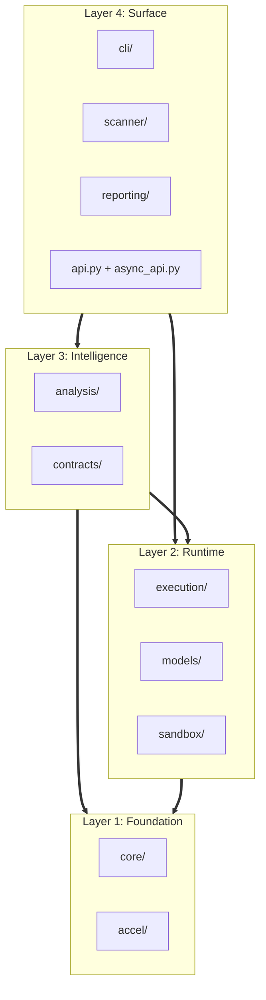

# PySyMex Codebase Blueprint

This document proposes a cleaner architecture for PySyMex. It maps **every existing file** to a maintainable target layout, fixes naming ugliness, and ensures the structure produces clean diagrams.

---

## Goals

- Separate concerns by responsibility, not by history.
- Make dependency direction obvious and enforceable.
- Replace `x.py` + `x_core.py` + `x_types.py` sprawl with `x/` packages.
- Every package and file accounted for — no orphans.
- Keep migration incremental, without a large destabilizing rewrite.

---

## Current Problems

### 1. Naming Sprawl
The codebase has a recurring pattern where a single concern is split across multiple flat files with suffixed names:

```
core/object_model.py          # facade
core/object_model_core.py     # implementation
core/object_model_types.py    # type definitions
```

This repeats for `memory_model`, `symbolic_types`, `exceptions`, `parallel`, `iterators`, and more. It's ugly and produces noisy file listings.

**Fix**: Convert each group into a sub-package with clean internal names:
```
core/objects/
├── __init__.py    # public API (replaces facade)
├── engine.py      # implementation (replaces _core)
└── types.py       # type definitions (replaces _types)
```

### 2. Flat File Explosion
`core/` has **43 flat files**. `models/` has **29 flat files**. These are too many siblings at one level for any human or diagram tool to reason about.

### 3. Missing Packages in the Old Blueprint
The previous blueprint only covered 6 packages. The actual codebase has 16 directories + 15 loose files. The following had no target:
`reporting/`, `scanner/`, `tracing/`, `contracts/`, `plugins/`, `testing/`, `benchmarks/`, `ci/`, `logging.py`, `resources.py`, `_typing.py`, `_constants.py`, `_deps.py`.

---

## Target Blueprint

```
pysymex/
│
│   # ── Private utilities ─────────────────────
│   __init__.py                  # Lazy-loaded public exports
│   __main__.py                  # python -m pysymex entry
│   _compat.py                   # CPython version shims
│   _constants.py                # Engine-wide constants
│   _deps.py                     # Optional dependency probing
│   _typing.py                   # Shared type aliases
│
│   # ════════════════════════════════════════════════════
│   #  LAYER 1 — FOUNDATION  (Semantic Foundation)
│   #  "What symbolic values and constraints MEAN"
│   # ════════════════════════════════════════════════════
│
├── core/
│   ├── types/                   # Symbolic value system
│   │   ├── __init__.py
│   │   ├── base.py              # SymbolicValue base class
│   │   ├── scalars.py           # Int, Bool, Float, None
│   │   ├── containers.py        # List, Dict, Set, Tuple, String
│   │   ├── numeric.py           # Arithmetic semantics
│   │   ├── floats.py            # IEEE-754 modeling
│   │   ├── checks.py            # Type guard utilities
│   │   └── havoc.py             # Unmodeled value generation
│   │
│   ├── memory/                  # Heap and object model
│   │   ├── __init__.py
│   │   ├── heap.py              # Core heap model
│   │   ├── types.py             # Memory-related types
│   │   ├── addressing.py        # Symbolic address resolution
│   │   ├── cow.py               # Copy-on-write internals
│   │   └── collections/         # Symbolic collection operations
│   │       ├── __init__.py
│   │       ├── lists.py         # SymbolicList ops
│   │       └── mappings.py      # SymbolicDict ops
│   │
│   ├── objects/                 # Python object model
│   │   ├── __init__.py
│   │   ├── model.py             # Attribute resolution, MRO
│   │   ├── types.py             # Object-related types
│   │   └── oop.py               # Class/inheritance support
│   │
│   ├── solver/                  # Z3 integration
│   │   ├── __init__.py
│   │   ├── engine.py            # ShadowSolver, tactics, cache
│   │   ├── constraints.py       # Constraint hashing & simplification
│   │   ├── independence.py      # Constraint independence splitting
│   │   └── unsat.py             # UNSAT core extraction
│   │
│   ├── graph/                   # Constraint hypergraph & treewidth
│   │   ├── __init__.py
│   │   └── treewidth.py         # CHTD decomposition
│   │
│   ├── iterators/               # Iterator protocol modeling
│   │   ├── __init__.py
│   │   ├── base.py              # Iterator abstractions
│   │   └── combinators.py       # Zip, chain, product, etc.
│   │
│   ├── exceptions/              # Exception value modeling
│   │   ├── __init__.py
│   │   ├── types.py             # Exception type hierarchy
│   │   └── analyzer.py          # Exception flow analysis
│   │
│   ├── parallel/                # Multi-core state management
│   │   ├── __init__.py
│   │   ├── core.py              # Parallel state splitting
│   │   └── types.py             # Parallel-related types
│   │
│   ├── optimization.py          # State merging heuristics
│   ├── state.py                 # VMState and immutable ops
│   ├── cache.py                 # Instruction cache
│   └── shutdown.py              # Graceful shutdown hooks
│
├── accel/                       # Hardware Acceleration
│   ├── __init__.py
│   ├── dispatcher.py            # Backend selection logic
│   ├── bytecode.py              # Constraint IR compilation
│   ├── optimizer.py             # CSE, register compaction
│   ├── sampling.py              # Thompson sampling for paths
│   ├── memory.py                # Device memory management
│   ├── chtd.py                  # CHTD solver integration
│   ├── async_exec.py            # Async acceleration executor
│   ├── benchmark.py             # Performance measurement
│   └── backends/                # Hardware backends
│       ├── __init__.py
│       ├── cpu.py               # Numba JIT backend
│       ├── gpu.py               # CuPy CUDA backend
│       └── reference.py         # Pure-Python reference
│
│   # ════════════════════════════════════════════════════
│   #  LAYER 2 — RUNTIME  (Execution & Environment)
│   #  "How bytecode is run and how the environment behaves"
│   # ════════════════════════════════════════════════════
│
├── execution/                   # VM loop and Opcode dispatch
│   ├── vm.py                    # Fetch-decode-execute loop
│   ├── dispatcher.py            # Version-aware opcode routing
│   ├── types.py                 # Execution-related types
│   ├── protocols.py             # Abstract executor interfaces
│   ├── termination.py           # Termination checking
│   │
│   ├── executors/               # Executor variants
│   │   ├── __init__.py
│   │   ├── core.py              # Main symbolic executor
│   │   ├── facade.py            # Public SymbolicExecutor API
│   │   ├── async_exec.py        # Async executor
│   │   ├── concurrent.py        # Concurrency executor
│   │   └── verified.py          # Verified execution mode
│   │
│   ├── opcodes/                 # Bytecode handlers
│   │   ├── __init__.py
│   │   ├── base/                # Stable cross-version handlers
│   │   │   ├── __init__.py
│   │   │   ├── arithmetic.py
│   │   │   ├── collections.py
│   │   │   ├── compare.py
│   │   │   ├── control.py
│   │   │   ├── exceptions.py
│   │   │   ├── functions.py
│   │   │   ├── locals.py
│   │   │   ├── stack.py
│   │   │   └── async_ops.py
│   │   ├── py311/               # 3.11-specific divergence
│   │   ├── py312/               # 3.12-specific divergence
│   │   └── py313/               # 3.13-specific divergence
│   │
│   └── strategies/              # Path exploration policies
│       ├── __init__.py
│       ├── manager.py           # Path scheduling (from analysis/path_manager)
│       └── merger.py            # State merging strategy (from analysis/state_merger)
│
├── models/                      # Stdlib and Built-in simulations
│   ├── __init__.py              # Registry + model discovery
│   │
│   ├── builtins/                # Built-in function models
│   │   ├── __init__.py
│   │   ├── base.py              # Model base class
│   │   ├── core.py              # len, print, range, type, ...
│   │   └── extended.py          # map, filter, zip, sorted, ...
│   │
│   ├── containers/              # Container method models
│   │   ├── __init__.py
│   │   ├── lists.py
│   │   ├── dicts.py
│   │   ├── sets.py
│   │   ├── tuples.py
│   │   ├── strings.py
│   │   ├── bytes.py
│   │   └── frozensets.py
│   │
│   ├── stdlib/                  # Standard library models
│   │   ├── __init__.py
│   │   ├── math.py
│   │   ├── io.py
│   │   ├── data.py              # json, csv, struct
│   │   ├── system.py            # os, sys, platform
│   │   ├── collections.py       # collections module
│   │   ├── pathlib.py
│   │   ├── regex.py
│   │   ├── dataclasses.py
│   │   ├── functools.py
│   │   ├── itertools.py
│   │   └── contextlib.py
│   │
│   ├── concurrency/             # Async and threading models
│   │   ├── __init__.py
│   │   ├── asyncio.py
│   │   └── threading.py
│   │
│   ├── numeric.py               # Numeric type models
│   └── objects.py               # Generic object protocol models
│
├── sandbox/                     # Security isolation backends
│   ├── __init__.py
│   ├── runner.py                # SandboxRunner / SecureSandbox
│   ├── bridge.py                # Cross-version IPC
│   ├── execution.py             # Hardened builtins & exec
│   ├── validation.py            # Input validation
│   ├── types.py                 # SandboxConfig, SandboxResult
│   ├── errors.py                # SandboxError hierarchy
│   └── isolation/               # OS-specific backends
│       ├── __init__.py          # IsolationBackend interface
│       ├── linux.py             # Linux namespace isolation
│       ├── windows.py           # Windows Job Object isolation
│       ├── subprocess.py        # Fallback subprocess isolation
│       ├── wasm.py              # WebAssembly sandbox
│       └── harness.py           # Jail harness script generation
│
│   # ════════════════════════════════════════════════════
│   #  LAYER 3 — INTELLIGENCE  (Observation & Detection)
│   #  "Finding bugs, tracking data, proving properties"
│   # ════════════════════════════════════════════════════
│
├── analysis/                    # Detectors, Taint, Dataflow
│   │   # ── Detectors ──────────────────────────────────
│   ├── detectors/               # Bug detection modules
│   │   ├── __init__.py
│   │   ├── base.py              # Detector interface + Issue types
│   │   ├── static.py            # AST-level detectors
│   │   ├── specialized.py       # Symbolic-aware detectors
│   │   ├── formal.py            # Formal verification detectors
│   │   ├── protocols.py         # Protocol compliance checking
│   │   └── filter.py            # False positive filtering
│   │
│   │   # ── Taint ──────────────────────────────────────
│   ├── taint/                   # Information flow tracking
│   │   ├── __init__.py
│   │   ├── core.py              # Taint propagation engine
│   │   ├── checker.py           # Source-sink validation
│   │   └── types.py             # Taint labels and policies
│   │
│   │   # ── Contracts ──────────────────────────────────
│   ├── contracts/               # Design-by-contract
│   │   ├── __init__.py
│   │   ├── compiler.py          # Contract AST → constraints
│   │   ├── decorators.py        # @requires, @ensures, @invariant
│   │   ├── quantifiers.py       # ∀/∃ quantifier support
│   │   └── types.py             # Contract type definitions
│   │
│   │   # ── Data Flow ──────────────────────────────────
│   ├── dataflow/                # Classical dataflow analyses
│   │   ├── __init__.py
│   │   ├── core.py              # Reaching defs, live vars, def-use
│   │   └── types.py
│   │
│   │   # ── Abstract Interpretation ────────────────────
│   ├── abstract/                # Abstract domains
│   │   ├── __init__.py
│   │   ├── domains.py           # Interval, sign, parity domains
│   │   ├── interpreter.py       # Abstract transfer functions
│   │   └── types.py             # Abstract value types
│   │
│   │   # ── Type System ────────────────────────────────
│   ├── types/                   # Type inference & constraints
│   │   ├── __init__.py
│   │   ├── inference.py         # Type inference engine
│   │   ├── environment.py       # Type environment
│   │   ├── kinds.py             # PyType, TypeKind
│   │   ├── patterns.py          # Type patterns
│   │   ├── constraints.py       # Type constraint encoding
│   │   └── stubs.py             # Type stub generation
│   │
│   │   # ── Interprocedural ────────────────────────────
│   ├── interprocedural/         # Cross-function analysis
│   │   ├── __init__.py
│   │   ├── callgraph.py         # Call graph construction
│   │   ├── summaries.py         # Function summaries
│   │   ├── cross_function.py    # Effect analysis
│   │   └── types.py
│   │
│   │   # ── Control Flow ───────────────────────────────
│   ├── control/                 # CFG, loops, dead code
│   │   ├── __init__.py
│   │   ├── cfg.py               # Control flow graph
│   │   ├── loops.py             # Loop detection, bounds, widening
│   │   ├── dead_code.py         # Dead/unreachable code
│   │   └── types.py
│   │
│   │   # ── Specialized ────────────────────────────────
│   ├── specialized/             # Domain-specific analyses
│   │   ├── __init__.py
│   │   ├── arithmetic.py        # Div-by-zero, overflow
│   │   ├── bounds.py            # Index out-of-bounds
│   │   ├── strings.py           # String analysis
│   │   ├── none.py              # None/null checks
│   │   ├── ranges.py            # Range analysis
│   │   ├── escape.py            # Escape analysis
│   │   ├── assertions.py        # Assertion context
│   │   ├── invariants.py        # Loop invariants
│   │   └── flow.py              # Flow-sensitive refinement
│   │
│   │   # ── Resources ──────────────────────────────────
│   ├── resources/               # Resource leak detection
│   │   ├── __init__.py
│   │   ├── lifecycle.py         # State machine tracking
│   │   └── types.py
│   │
│   │   # ── Concurrency ────────────────────────────────
│   ├── concurrency/             # Race detection
│   │   ├── __init__.py
│   │   ├── core.py
│   │   └── interleaving.py
│   │
│   │   # ── Infrastructure ─────────────────────────────
│   ├── pipeline/                # Analysis orchestration
│   │   ├── __init__.py
│   │   ├── phases.py            # Pass ordering
│   │   └── types.py
│   │
│   ├── cache/                   # Analysis result caching
│   │   ├── __init__.py
│   │   ├── core.py
│   │   └── invalidation.py
│   │
│   ├── integration/             # Integration bindings
│   │   ├── __init__.py
│   │   ├── core.py
│   │   └── formal.py
│   │
│   ├── concolic.py              # Concolic execution support
│   ├── autotuner.py             # Analysis parameter tuning
│   └── protocols.py             # Protocol checking
│
├── contracts/                   # Top-level quantifier logic
│   ├── __init__.py
│   └── quantifiers/
│       ├── __init__.py
│       ├── core.py
│       └── types.py
│
├── tracing/                     # Execution tracing & profiling
│   ├── __init__.py
│   ├── tracer.py                # Trace recorder
│   ├── analyzer.py              # Trace analysis CLI
│   ├── hooks.py                 # Hook adapters
│   ├── schemas.py               # Trace data schemas
│   └── z3_utils.py              # Z3 trace utilities
│
├── plugins/                     # Plugin extension system
│   ├── __init__.py
│   └── base.py                  # Plugin base class
│
├── testing/                     # Dev testing utilities
│   ├── __init__.py
│   ├── fuzzing.py               # Property-based fuzzing
│   └── soundness.py             # Core soundness checks
│
├── benchmarks/                  # Performance benchmarks
│   ├── __init__.py
│   └── suite/
│       ├── __init__.py
│       ├── core.py
│       └── types.py
│
├── ci/                          # CI/CD helpers
│   ├── __init__.py
│   ├── core.py                  # Perf gate logic
│   └── types.py
│
│   # ════════════════════════════════════════════════════
│   #  LAYER 4 — SURFACE  (User Interaction)
│   # ════════════════════════════════════════════════════
│
├── cli/                         # Command-line interface
│   ├── __init__.py
│   ├── commands.py              # Subcommand implementations
│   ├── parser.py                # Argument parsing
│   ├── scan.py                  # Scan command logic
│   └── reporter.py              # CLI scan output formatting
│
├── scanner/                     # Discovery pipelines
│   ├── __init__.py
│   ├── core.py                  # Synchronous scanner
│   ├── async_scanner.py         # Async scanner
│   └── types.py                 # ScanResult, ScanConfig
│
├── reporting/                   # Output formatters
│   ├── __init__.py
│   ├── formatters.py            # Text/table formatters
│   ├── html.py                  # HTML report generation
│   ├── realtime.py              # Live progress display
│   ├── reproduction.py          # Bug reproduction scripts
│   └── sarif/                   # SARIF standard output
│       ├── __init__.py
│       ├── core.py
│       └── types.py
│
├── api.py                       # Synchronous public API
├── async_api.py                 # Asynchronous public API
├── config.py                    # Typed configuration
├── logging.py                   # Structured logging
├── resources.py                 # Resource management
├── watch.py                     # File watcher (live re-analysis)
└── verify_cli.py                # CLI verification helpers
```

---

## Layered Architecture Diagram



---

## Dependency Direction Rules

- **Downward Only**: Higher layers may import from lower layers.
- **Peer-to-Peer**: Folders within the same layer may import from each other ONLY if they don't create circular cycles.
- **No Upward Imports**: A lower layer MUST NOT import from a higher layer.

| Layer | May Import From | MUST NOT Import From |
| :--- | :--- | :--- |
| **4. Surface** | 3, 2, 1 | - |
| **3. Intelligence** | 2, 1 | 4 |
| **2. Runtime** | 1 | 4, 3 |
| **1. Foundation** | - | 4, 3, 2 |

---

## Known Violations to Fix

| Violation | Current | Fix |
| :--- | :--- | :--- |
| `core → analysis` | `core/` imports something from `analysis/` | Break the cycle; move shared types to `core/` |
| `execution → analysis` | `execution/` imports `Issue` | Move shared types to `core/` |
| `scanner ↔ cli` | Circular import | Extract shared types to `scanner/types.py` |

---

## Design Principles

1. **One folder, one reason to change.** If a folder has files that change for different reasons, split it.
2. **No naming sprawl.** If you have `foo.py` + `foo_core.py` + `foo_types.py`, make it `foo/`.
3. **Strict downward deps.** Upper layers may import lower layers. Never the reverse.
4. **Facades over deep imports.** Each package's `__init__.py` is the public API. Internal files are private.
5. **Version isolation.** Python-version-specific behavior lives only in `execution/opcodes/pyXYZ/`.
6. **Optional dependencies are guarded.** `accel/` and `sandbox/` fail gracefully when CuPy/wasmtime are missing.
