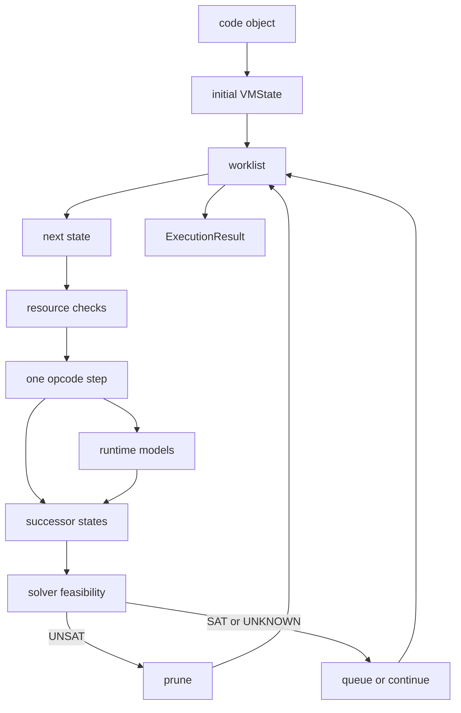

# Flow

The execution flow is the symbolic VM loop. It consumes a code object, builds an initial `VMState`,
drains a worklist, dispatches CPython bytecode handlers, and records an `ExecutionResult`.

## Method

## VM State

`VMState` is the mutable record for one symbolic path. It carries the operand stack, locals,
globals, memory, path constraints, bytecode position, branch trace, call/block stacks, active
exception data, pending detector issues, loop counters, open-resource metadata, and modeled write
events.

Forking isolates mutable path data while preserving persistent histories and shared immutable
structures. The state stores constraints; it does not decide whether the path is feasible.

## Opcode Dispatch

Opcode handlers live under versioned and shared execution packages. They implement stack effects,
control flow, exceptions, calls, iteration, context managers, and container operations. When
semantic behavior changes, CPython bytecode evidence is the strongest comparison point.

Unsupported or approximate behavior should record an unsupported, blocked, inconclusive, or
degraded outcome when precision matters. It should not become an unmarked concrete fallback.

## Result Meaning

`ExecutionResult` records issues, path counts, coverage, time, solver statistics, final snapshots,
suppressed offsets, and degraded passes. The result type states the key rule: it does not prove all
feasible paths were explored, and an empty issue list is not global safety evidence.

## Evidence In Source

- Executor assembly: `pysymex/_internal/execution/executors/core.py`
- Worklist loop: `pysymex/_internal/execution/engine/worklist.py`
- Run setup and result finalization: `pysymex/_internal/execution/engine`
- VM state: `pysymex/_internal/core/state`
- Opcode handlers: `pysymex/_internal/execution/opcodes`
- Result type: `pysymex/_internal/execution/results/result.py`
- Tests: `tests/unit/execution`, `tests/unit/scanner`

## Limits

Execution is bounded by paths, depth, iterations, time, resource checks, opcode support, model
precision, and solver outcomes. Solver `UNKNOWN` keeps a path potentially feasible; it is not proof
of safety or proof of a bug.
