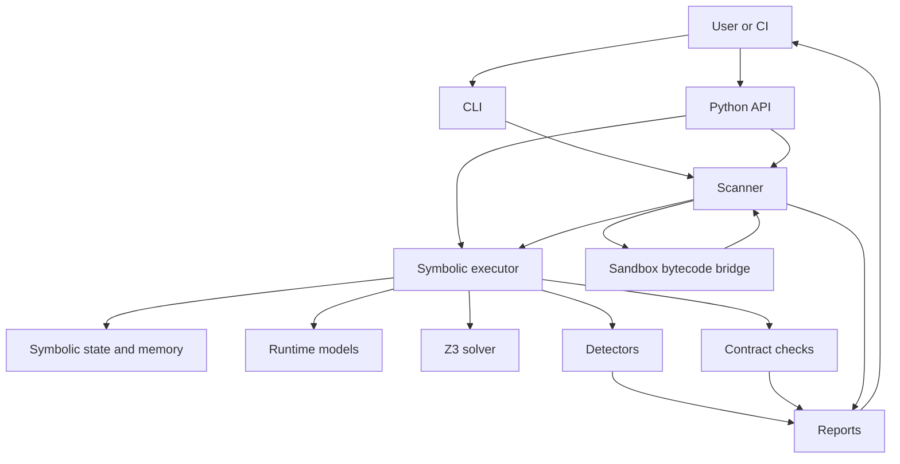
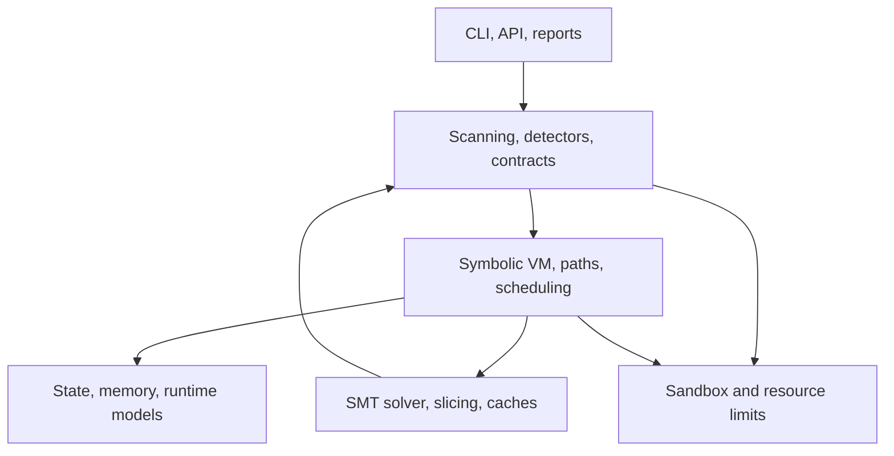

# Overview

PySyMex analyzes Python by compiling source, extracting code objects, executing supported CPython
bytecode with symbolic values, asking Z3 about path feasibility, and reporting findings only when
the active evidence supports them.

## System Shape

## Layered View

Upper layers decide what to analyze and how to present evidence. Lower layers create the evidence:
bytecode paths, symbolic state, model outcomes, solver answers, sandbox results, and limit states.

## Method

1. The CLI or API receives a file, directory, function, or code snippet.
2. The scanner discovers target code objects and source-level scan paths.
3. Sandbox-backed extraction compiles target source inside isolation when sandboxing is enabled.
4. The symbolic executor creates `VMState` paths and dispatches version-specific opcode handlers.
5. Runtime models cover supported builtins, containers, objects, and standard-library calls.
6. Branches and issue conditions become Z3 constraints.
7. Solver results stay structured as SAT, UNSAT, or UNKNOWN.
8. Worklist scheduling chooses the next path to explore.
9. Resource limits, unsupported behavior, and degraded passes are recorded.
10. Detectors and contract checks emit findings only when they have evidence for the active path.
11. Reporting layers serialize the evidence without inventing new verification meaning.

## Trust Boundary

PySyMex is bounded and model-driven. A clean result means no definite issue was reported for the
explored supported behavior. It does not prove that every feasible runtime behavior was modeled,
that every path was explored, or that native isolation proved the target harmless.

The main invariant is explicit uncertainty. Solver `UNKNOWN`, timeout, unsupported bytecode,
modeling gaps, sandbox denial, path limits, and degraded passes must stay visible to callers and
reports.

## Evidence In Source

- Scanning: `pysymex/scanner`, `pysymex/analysis/scan`
- Execution: `pysymex/execution`, `pysymex/core/state`
- Solver: `pysymex/core/solver`
- Models: `pysymex/models`
- Detectors: `pysymex/analysis/detectors`
- Sandbox: `pysymex/sandbox`
- Reports: `pysymex/reporting`, `pysymex/cli/formatters`

## Related Pages

Read [SCANNING.md](SCANNING.md), [FLOW.md](FLOW.md), and [SOLVER.md](SOLVER.md) for the main
pipeline. Read [SANDBOX.md](SANDBOX.md), [POLAR.md](POLAR.md), [CEGIS.md](CEGIS.md), and
[LIMITS.md](LIMITS.md) for the high-risk boundaries.
