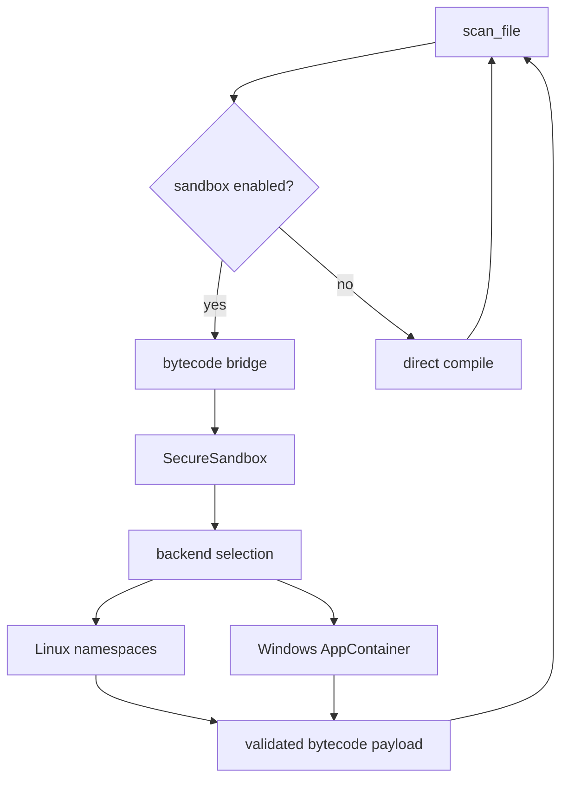

# Sandbox

The sandbox is the containment boundary for target-controlled compilation or execution. It is not a
proof that the target program is safe. Setup failure, policy denial, timeout, memory exhaustion, CPU
exhaustion, and security violation are blocked or inconclusive analysis states.

## Method

`SecureSandbox` is the public runner. It selects or creates a backend, calls setup, checks reported
capabilities against the required capability contract, executes staged code, and cleans up the jail.
If a backend does not satisfy required capabilities after setup, sandbox setup fails.

## Backends

| Backend | Current behavior |
| --- | --- |
| Linux namespaces | Uses trusted `unshare`, user/mount/pid/net/ipc namespaces, a root jail when supported, optional seccomp, and process limits. |
| Windows AppContainer | Builds or reuses an AppContainer profile, stages a Python runtime, grants jail ACLs, creates a Job Object, and runs self-checks. |

Auto-selection is platform-dependent. Linux prefers namespaces. Windows prefers AppContainer. If
no native strong backend is available, setup fails.

## Capability Contract

Sandbox capabilities are explicit booleans: process isolation, filesystem jail, network blocking,
syscall filtering, memory limits, CPU limits, and process limits. The strict default requires all of
them except syscall filtering on Windows AppContainer, where that backend does not report syscall
filtering.

Capability probes are not full execution proofs. They are availability and setup checks that must
be paired with backend-specific self-checks and tests.

## Staging Policy

Target code and extra files are staged under an ephemeral jail. Path policy rejects absolute paths,
drive prefixes, traversal, device names, stream syntax, option-like segments, control characters,
unsafe trailing dots or spaces, executable/native suffixes, and paths that resolve outside the jail.

Supplemental payloads are capped by file count, per-file size, and total size. The bytecode bridge
also caps serialized result payloads.

## Result States

Sandbox execution returns structured states: `SUCCESS`, `FAILED`, `TIMEOUT`, `MEMORY_EXCEEDED`,
`CPU_EXCEEDED`, `SECURITY_VIOLATION`, `CRASH`, and `SETUP_ERROR`.

`SUCCESS` only means the sandbox operation completed. Resource failures, policy denials, crashes,
and setup errors must remain visible to the scanner or caller.

## Cleanup

Each backend removes the jail and kills tracked processes. Windows also tears down profile/runtime
state. Linux tracks child process groups. Cleanup failures are logged because stale processes,
writable files, or reused capabilities can affect later runs.

## Evidence In Source

- Runner and capability checks: `pysymex/_internal/sandbox/runner.py`, `pysymex/_internal/sandbox/backends.py`
- Result and config types: `pysymex/_internal/sandbox/types.py`
- Path policy: `pysymex/_internal/sandbox/paths.py`
- Bytecode bridge: `pysymex/_internal/sandbox/bridge`
- Backends: `pysymex/_internal/sandbox/isolation`
- Tests: `tests/unit/sandbox`

## Limits

The sandbox is OS-native where a backend exists. Docker is not the main security boundary for the
engine. Docker is used by the test runner to exercise multiple Python versions and host setups.

If analysis needs a denied capability, the correct result is policy denial, unsupported behavior,
or degraded analysis. The sandbox should not be relaxed silently.
