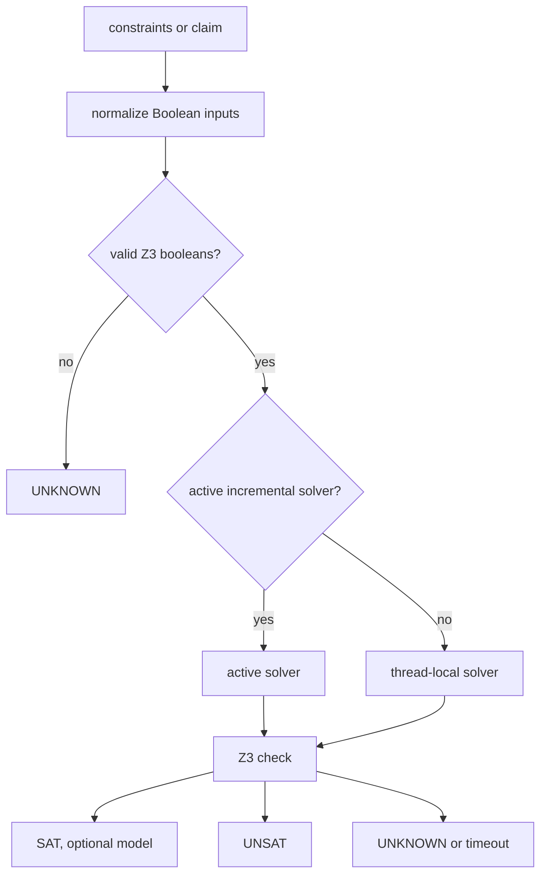

# Solver

The solver layer uses Z3 for path feasibility, model extraction, and proof obligations. Its main
contract is to preserve SAT, UNSAT, and UNKNOWN as separate outcomes.

## Method

## Outcomes

| Outcome | Meaning |
| --- | --- |
| SAT | The encoded constraints are feasible. A model may witness the active encoding. |
| UNSAT | The encoded constraints are infeasible. This can justify pruning that path. |
| UNKNOWN | The engine did not establish SAT or UNSAT. Malformed input, Z3 unknown, deadlines, and query failures land here. |

Callers that need evidence use structured APIs such as `check_sat_result`, `get_model_result`, and
direct `IncrementalSolver` checks. Boolean shortcuts must not be used when inconclusive states
matter.

## Caches And Context

The incremental solver keeps scoped Z3 assertions, structural result caches, warm-start models, and
exact UNSAT-subset reuse. Standalone query helpers also register process-local cache clearing so
`--no-cache` can force fresh analysis paths.

Cache hits are not accepted from hashes alone. The solver uses secondary discriminators and live
expression checks to prevent unrelated constraints from sharing SAT or UNSAT evidence.

## Proof Claims

Proof-style callers must check the negated obligation through structured solver results. A SAT
negation is a counterexample, UNSAT proves the encoded obligation, and UNKNOWN remains
inconclusive.

## Evidence In Source

- Solver results: `pysymex/_internal/core/solver/engine/results.py`
- Incremental solver: `pysymex/_internal/core/solver/engine/incremental.py`
- Query helpers: `pysymex/_internal/core/solver/engine/queries.py`
- SAT and cache logic: `pysymex/_internal/core/solver/engine`
- Tests: `tests/unit/core/solver`

## Limits

Z3 works on the encoded model, not on full Python semantics. Unsupported Python behavior, havoc,
path limits, model gaps, solver timeout, and solver `UNKNOWN` must not become verified safety.
